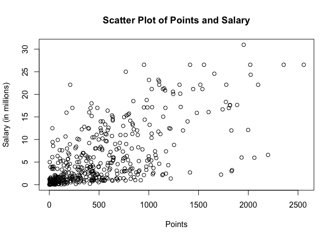
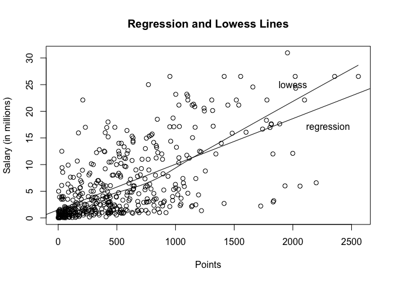

hw01-yowsean-li
================
Yowsean Li
9/14/2017

``` r
# load data file
load("data/nba2017-salary-points.RData")
ls()
```

    ## [1] "experience" "player"     "points"     "points1"    "points2"   
    ## [6] "points3"    "position"   "salary"     "team"

1. Data Preprocessing
=====================

``` r
salary_millions = salary / 1000000
```

``` r
experience <- as.numeric(replace(experience, experience=="R", 0))
```

``` r
position_fac <- factor(position)
levels(position_fac) <- c('center', 'power_fwd', 'point_guard', 'small_fwd', 'shoot_guard')
```

``` r
table(position_fac)
```

    ## position_fac
    ##      center   power_fwd point_guard   small_fwd shoot_guard 
    ##          89          89          85          83          95

2. Scatterplot of Points and Salary
===================================

``` r
plot(points, salary_millions, xlab='Points', ylab='Salary (in millions)')
```



3. Correlation between Points and Salary
========================================

``` r
n <- length(player)
mean_points <- sum(points) / n
mean_salary <- sum(salary_millions) / n
var_points <- sum((points - mean_points)^2) / (n-1)
var_salary <- sum((salary_millions - mean_salary)^2) / (n-1)
sd_points <- sqrt(var_points)
sd_salary <- sqrt(var_salary)
cov_pts_salary <- sum((points - mean_points)*(salary_millions - mean_salary)) / (n-1)
cor_pts_salary <- cov_pts_salary / (sd_points * sd_salary)
```

4. Simple Linear Regression
===========================

``` r
b_1 <- cor_pts_salary * (sd_salary / sd_points)
b_0 <- mean_salary - b_1 * mean_points
X <- points
Y <- b_0 + b_1 * X

summary(Y)
```

    ##    Min. 1st Qu.  Median    Mean 3rd Qu.    Max. 
    ##   1.510   2.845   5.206   6.187   8.184  23.398

1.  

-   Minimum: 1.510
-   1st Quartile: 2.845
-   Median: 5.206
-   Mean: 6.187
-   3rd Quartile: 8.184
-   Maximum: 23.298

1.  The regression equation is

``` r
Y_hat <- 1.510 + 0.009 * X
```

1.  The slope coefficient b\_1 is the average increase in salary per point starting from the intercept.
2.  The intercept term b\_0 is the minimum salary.
3.  

-   0 points: 1.510 million
-   100 points: 2.366 million
-   500 points: 5.789 million
-   1000 points: 10.067 million
-   2000 points: 18.623 million

5. Plotting the Regression Line
===============================

``` r
plot(points, salary_millions, xlab='Points', ylab='Salary (in millions)')
abline(b_0, b_1)
lines(lowess(points, salary_millions))
text(2300, 17, labels = 'regression')
text(2000, 25, labels = 'lowess')
```



6. Regression Residuals and Coefficient of Determination *R*<sup>2</sup>
========================================================================
