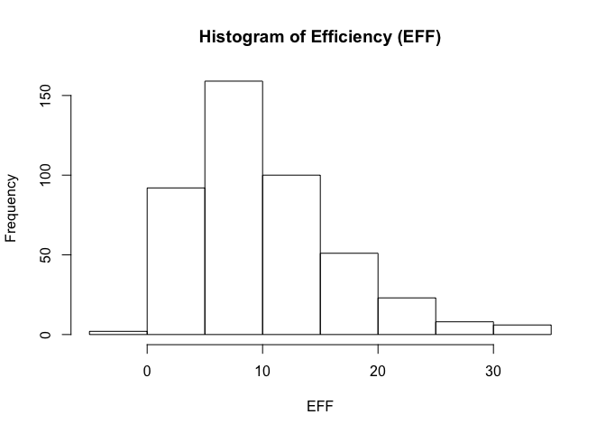
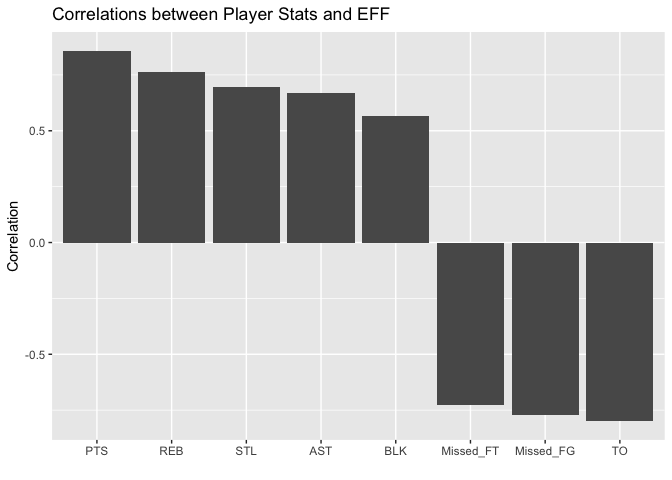
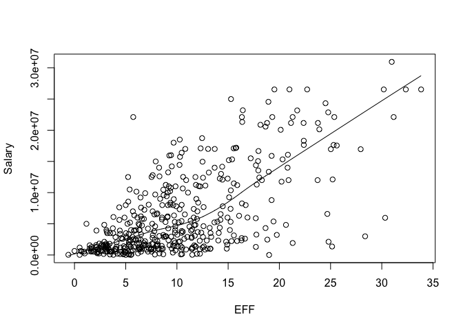
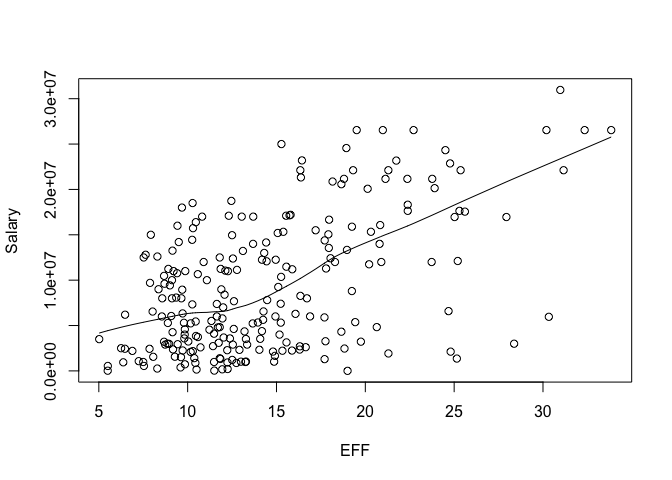

hw02-yowsean-li
================
Yowsean Li
9/28/2017

``` r
library(readr)
library(dplyr)
```

    ## 
    ## Attaching package: 'dplyr'

    ## The following objects are masked from 'package:stats':
    ## 
    ##     filter, lag

    ## The following objects are masked from 'package:base':
    ## 
    ##     intersect, setdiff, setequal, union

``` r
library(ggplot2)
```

2. Import the data in R
=======================

``` r
dat <- read.csv('data/nba2017-player-statistics.csv',colClasses=c("character", "character", "factor", "character", "double", rep("integer", 19)))
str(dat)
```

    ## 'data.frame':    441 obs. of  24 variables:
    ##  $ Player      : chr  "Al Horford" "Amir Johnson" "Avery Bradley" "Demetrius Jackson" ...
    ##  $ Team        : chr  "BOS" "BOS" "BOS" "BOS" ...
    ##  $ Position    : Factor w/ 5 levels "C","PF","PG",..: 1 2 5 3 4 3 4 5 4 2 ...
    ##  $ Experience  : chr  "9" "11" "6" "R" ...
    ##  $ Salary      : num  26540100 12000000 8269663 1450000 1410598 ...
    ##  $ Rank        : int  4 6 5 15 11 1 3 13 8 10 ...
    ##  $ Age         : int  30 29 26 22 31 27 26 21 20 29 ...
    ##  $ GP          : int  68 80 55 5 47 76 72 29 78 78 ...
    ##  $ GS          : int  68 77 55 0 0 76 72 0 20 6 ...
    ##  $ MIN         : int  2193 1608 1835 17 538 2569 2335 220 1341 1232 ...
    ##  $ FGM         : int  379 213 359 3 95 682 333 25 192 114 ...
    ##  $ FGA         : int  801 370 775 4 232 1473 720 58 423 262 ...
    ##  $ Points3     : int  86 27 108 1 39 245 157 12 46 45 ...
    ##  $ Points3_atts: int  242 66 277 1 111 646 394 35 135 130 ...
    ##  $ Points2     : int  293 186 251 2 56 437 176 13 146 69 ...
    ##  $ Points2_atts: int  559 304 498 3 121 827 326 23 288 132 ...
    ##  $ FTM         : int  108 67 68 3 33 590 176 6 85 26 ...
    ##  $ FTA         : int  135 100 93 6 41 649 217 9 124 37 ...
    ##  $ OREB        : int  95 117 65 2 17 43 48 6 45 60 ...
    ##  $ DREB        : int  369 248 269 2 68 162 367 20 175 213 ...
    ##  $ AST         : int  337 140 121 3 33 449 155 4 64 71 ...
    ##  $ STL         : int  52 52 68 0 9 70 72 10 35 26 ...
    ##  $ BLK         : int  87 62 11 0 7 13 23 2 18 17 ...
    ##  $ TO          : int  116 77 88 0 25 210 79 4 68 39 ...

``` r
dat <- read_csv('data/nba2017-player-statistics.csv',
                col_types = cols(
                  .default = "i",
                  Player = "c",
                  Team = "c",
                  Position = col_factor(levels=c("C","PF","SF","SG","PG")),
                  Experience = "c",
                  Salary = "d"))
str(dat)
```

    ## Classes 'tbl_df', 'tbl' and 'data.frame':    441 obs. of  24 variables:
    ##  $ Player      : chr  "Al Horford" "Amir Johnson" "Avery Bradley" "Demetrius Jackson" ...
    ##  $ Team        : chr  "BOS" "BOS" "BOS" "BOS" ...
    ##  $ Position    : Factor w/ 5 levels "C","PF","SF",..: 1 2 4 5 3 5 3 4 3 2 ...
    ##  $ Experience  : chr  "9" "11" "6" "R" ...
    ##  $ Salary      : num  26540100 12000000 8269663 1450000 1410598 ...
    ##  $ Rank        : int  4 6 5 15 11 1 3 13 8 10 ...
    ##  $ Age         : int  30 29 26 22 31 27 26 21 20 29 ...
    ##  $ GP          : int  68 80 55 5 47 76 72 29 78 78 ...
    ##  $ GS          : int  68 77 55 0 0 76 72 0 20 6 ...
    ##  $ MIN         : int  2193 1608 1835 17 538 2569 2335 220 1341 1232 ...
    ##  $ FGM         : int  379 213 359 3 95 682 333 25 192 114 ...
    ##  $ FGA         : int  801 370 775 4 232 1473 720 58 423 262 ...
    ##  $ Points3     : int  86 27 108 1 39 245 157 12 46 45 ...
    ##  $ Points3_atts: int  242 66 277 1 111 646 394 35 135 130 ...
    ##  $ Points2     : int  293 186 251 2 56 437 176 13 146 69 ...
    ##  $ Points2_atts: int  559 304 498 3 121 827 326 23 288 132 ...
    ##  $ FTM         : int  108 67 68 3 33 590 176 6 85 26 ...
    ##  $ FTA         : int  135 100 93 6 41 649 217 9 124 37 ...
    ##  $ OREB        : int  95 117 65 2 17 43 48 6 45 60 ...
    ##  $ DREB        : int  369 248 269 2 68 162 367 20 175 213 ...
    ##  $ AST         : int  337 140 121 3 33 449 155 4 64 71 ...
    ##  $ STL         : int  52 52 68 0 9 70 72 10 35 26 ...
    ##  $ BLK         : int  87 62 11 0 7 13 23 2 18 17 ...
    ##  $ TO          : int  116 77 88 0 25 210 79 4 68 39 ...
    ##  - attr(*, "spec")=List of 2
    ##   ..$ cols   :List of 24
    ##   .. ..$ Player      : list()
    ##   .. .. ..- attr(*, "class")= chr  "collector_character" "collector"
    ##   .. ..$ Team        : list()
    ##   .. .. ..- attr(*, "class")= chr  "collector_character" "collector"
    ##   .. ..$ Position    :List of 3
    ##   .. .. ..$ levels    : chr  "C" "PF" "SF" "SG" ...
    ##   .. .. ..$ ordered   : logi FALSE
    ##   .. .. ..$ include_na: logi FALSE
    ##   .. .. ..- attr(*, "class")= chr  "collector_factor" "collector"
    ##   .. ..$ Experience  : list()
    ##   .. .. ..- attr(*, "class")= chr  "collector_character" "collector"
    ##   .. ..$ Salary      : list()
    ##   .. .. ..- attr(*, "class")= chr  "collector_double" "collector"
    ##   .. ..$ Rank        : list()
    ##   .. .. ..- attr(*, "class")= chr  "collector_integer" "collector"
    ##   .. ..$ Age         : list()
    ##   .. .. ..- attr(*, "class")= chr  "collector_integer" "collector"
    ##   .. ..$ GP          : list()
    ##   .. .. ..- attr(*, "class")= chr  "collector_integer" "collector"
    ##   .. ..$ GS          : list()
    ##   .. .. ..- attr(*, "class")= chr  "collector_integer" "collector"
    ##   .. ..$ MIN         : list()
    ##   .. .. ..- attr(*, "class")= chr  "collector_integer" "collector"
    ##   .. ..$ FGM         : list()
    ##   .. .. ..- attr(*, "class")= chr  "collector_integer" "collector"
    ##   .. ..$ FGA         : list()
    ##   .. .. ..- attr(*, "class")= chr  "collector_integer" "collector"
    ##   .. ..$ Points3     : list()
    ##   .. .. ..- attr(*, "class")= chr  "collector_integer" "collector"
    ##   .. ..$ Points3_atts: list()
    ##   .. .. ..- attr(*, "class")= chr  "collector_integer" "collector"
    ##   .. ..$ Points2     : list()
    ##   .. .. ..- attr(*, "class")= chr  "collector_integer" "collector"
    ##   .. ..$ Points2_atts: list()
    ##   .. .. ..- attr(*, "class")= chr  "collector_integer" "collector"
    ##   .. ..$ FTM         : list()
    ##   .. .. ..- attr(*, "class")= chr  "collector_integer" "collector"
    ##   .. ..$ FTA         : list()
    ##   .. .. ..- attr(*, "class")= chr  "collector_integer" "collector"
    ##   .. ..$ OREB        : list()
    ##   .. .. ..- attr(*, "class")= chr  "collector_integer" "collector"
    ##   .. ..$ DREB        : list()
    ##   .. .. ..- attr(*, "class")= chr  "collector_integer" "collector"
    ##   .. ..$ AST         : list()
    ##   .. .. ..- attr(*, "class")= chr  "collector_integer" "collector"
    ##   .. ..$ STL         : list()
    ##   .. .. ..- attr(*, "class")= chr  "collector_integer" "collector"
    ##   .. ..$ BLK         : list()
    ##   .. .. ..- attr(*, "class")= chr  "collector_integer" "collector"
    ##   .. ..$ TO          : list()
    ##   .. .. ..- attr(*, "class")= chr  "collector_integer" "collector"
    ##   ..$ default: list()
    ##   .. ..- attr(*, "class")= chr  "collector_integer" "collector"
    ##   ..- attr(*, "class")= chr "col_spec"

3. Right after importing the data
=================================

``` r
dat$Experience[dat$Experience=="R"] <- "0"
dat$Experience <- as.integer(dat$Experience)
```

4. Performance of Players
=========================

``` r
dat$Missed_FG <- dat$FGA - dat$FGM
dat$Missed_FT <- dat$FTA - dat$FTM
dat$PTS <- dat$Points3 * 3 + dat$Points2 * 2 + dat$FTM
dat$REB <- dat$OREB + dat$DREB
dat$MPG <- dat$MIN/dat$GP
dat$EFF <- (dat$PTS + dat$REB + dat$AST + dat$STL + dat$BLK - dat$Missed_FG - dat$Missed_FT - dat$TO) / dat$GP
summary(dat$EFF)
```

    ##    Min. 1st Qu.  Median    Mean 3rd Qu.    Max. 
    ##  -0.600   5.452   9.090  10.137  13.247  33.840

``` r
hist(dat$EFF, xlab = "EFF", ylab = "Frequency", main = "Histogram of Efficiency (EFF)")
```



``` r
slice(arrange(select(dat, Player, Team, Salary, EFF), desc(EFF)), 0:10)
```

    ## # A tibble: 10 x 4
    ##                   Player  Team   Salary      EFF
    ##                    <chr> <chr>    <dbl>    <dbl>
    ##  1                  <NA>  <NA>       NA       NA
    ##  2     Russell Westbrook   OKC 26540100 33.83951
    ##  3          James Harden   HOU 26540100 32.34568
    ##  4         Anthony Davis   NOP 22116750 31.16000
    ##  5          LeBron James   CLE 30963450 30.97297
    ##  6    Karl-Anthony Towns   MIN  5960160 30.32927
    ##  7          Kevin Durant   GSW 26540100 30.19355
    ##  8 Giannis Antetokounmpo   MIL  2995421 28.37500
    ##  9      DeMarcus Cousins   NOP 16957900 27.94118
    ## 10          Jimmy Butler   CHI 17552209 25.60526

``` r
select(filter(dat, EFF < 0), Player)
```

    ## # A tibble: 1 x 1
    ##            Player
    ##             <chr>
    ## 1 Patricio Garino

``` r
cor_EFF <- cor(select(dat, PTS, REB, AST, STL, BLK, Missed_FG, Missed_FT, TO), select(dat, EFF))
cor_EFF[6] <- -1 * cor_EFF[6]
cor_EFF[7] <- -1 * cor_EFF[7]
cor_EFF[8] <- -1 * cor_EFF[8]
cor_EFF <- arrange(select(as.data.frame(as.table(cor_EFF)), Var1, Freq), desc(Freq))
cor_EFF$Var1 <- factor(cor_EFF$Var1, levels = cor_EFF$Var1)
cor_EFF
```

    ##        Var1       Freq
    ## 1       PTS  0.8588644
    ## 2       REB  0.7634501
    ## 3       STL  0.6957286
    ## 4       AST  0.6689232
    ## 5       BLK  0.5679571
    ## 6 Missed_FT -0.7271456
    ## 7 Missed_FG -0.7722477
    ## 8        TO -0.8003289

``` r
ggplot(data=cor_EFF, aes(x=Var1, y=Freq)) +
  geom_bar(stat='identity') +
  labs(title = "Correlations between Player Stats and EFF", x = "", y = "Correlation")
```



5. Efficiency and Salary
========================

``` r
plot(dat$EFF, dat$Salary, xlab="EFF", ylab="Salary")
lines(lowess(dat$EFF, dat$Salary))
```



``` r
cor(dat$EFF, dat$Salary)
```

    ## [1] 0.655624

The relationship between EFF and Salary is positively correlated. Once EFF reaches around 12.5, the increase in salary per EFF score seems to increase.

``` r
players2 <- filter(dat, MPG >= 20)
plot(players2$EFF, players2$Salary, xlab="EFF", ylab="Salary")
lines(lowess(players2$EFF, players2$Salary))
```



``` r
cor(players2$EFF, players2$Salary)
```

    ## [1] 0.5367224

The relationship between EFF and Salary for players who play at least 20 minutes per game is also positively correlated. This correlation is more linear than the correlation for all players since the increase in salary per EFF score is more consistent.

6. Comments and reflections
===========================

-   Some of the harder parts were getting the plots formatted correctly
-   Easier parts were manipulating the data frames
-   I didn't need help on the assignment
-   It took me a couple hours to complete the assignment
-   The most time consuming part was formatting plots
-   No particular part was frustrating or hard to understand
-   Being able to visualize the data in the plots was the most exciting part
