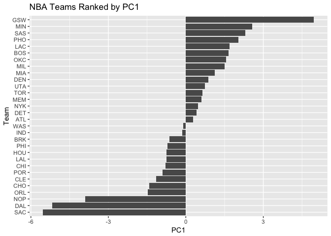

hw03-yowsean-li
================
Yowsean Li
10/5/2017

``` r
library(readr)    # importing data
library(dplyr)    # data wrangling
```

    ## 
    ## Attaching package: 'dplyr'

    ## The following objects are masked from 'package:stats':
    ## 
    ##     filter, lag

    ## The following objects are masked from 'package:base':
    ## 
    ##     intersect, setdiff, setequal, union

``` r
library(ggplot2)  # graphics
```

Ranking of Teams
----------------

``` r
teams <- read_csv('../data/nba2017-teams.csv')
```

    ## Parsed with column specification:
    ## cols(
    ##   team = col_character(),
    ##   experience = col_integer(),
    ##   salary = col_double(),
    ##   points3 = col_integer(),
    ##   points2 = col_integer(),
    ##   free_throws = col_integer(),
    ##   points = col_integer(),
    ##   off_rebounds = col_integer(),
    ##   def_rebounds = col_integer(),
    ##   assists = col_integer(),
    ##   steals = col_integer(),
    ##   blocks = col_integer(),
    ##   turnovers = col_integer(),
    ##   fouls = col_integer(),
    ##   efficiency = col_double()
    ## )

``` r
ordered_sal <- arrange(teams, desc(salary))
ordered_sal$team <- factor(ordered_sal$team, levels=ordered_sal$team[order(ordered_sal$salary)])
ggplot(data = ordered_sal, aes(x=team, y=salary)) +
  geom_bar(stat="identity") +
  coord_flip() +
  labs(title="NBA Teams Ranked by Total Salary") +
  ylab("Salary (in Millions)") +
  xlab("Team") +
  geom_hline(yintercept = mean(ordered_sal$salary), color="red")
```


Ranking of NBA teams by total salary of players.

``` r
ordered_sal <- arrange(teams, desc(points))
ordered_sal$team <- factor(ordered_sal$team, levels=ordered_sal$team[order(ordered_sal$points)])
ggplot(data = ordered_sal, aes(x=team, y=points)) +
  geom_bar(stat="identity") +
  coord_flip() +
  labs(title="NBA Teams Ranked by Total Points") +
  ylab("Total Points") +
  xlab("Team") +
  geom_hline(yintercept = mean(ordered_sal$points), color="red")
```


Ranking of NBA teams by total points scored.

``` r
ordered_sal <- arrange(teams, desc(efficiency))
ordered_sal$team <- factor(ordered_sal$team, levels=ordered_sal$team[order(ordered_sal$efficiency)])
ggplot(data = ordered_sal, aes(x=team, y=efficiency)) +
  geom_bar(stat="identity") +
  coord_flip() +
  labs(title="NBA Teams Ranked by Total Efficiency") +
  ylab("Total Efficiency") +
  xlab("Team") +
  geom_hline(yintercept = mean(ordered_sal$efficiency), color="red")
```


Ranking of NBA teams by total efficiency of players.

``` r
teams2 <- data.frame(select(teams, points3, points2, free_throws, off_rebounds, def_rebounds, assists, steals, blocks,turnovers, fouls))
rownames(teams2) <- teams$team

pca <- prcomp(teams2, scale.=TRUE)
team_pca <- data.frame(pca$x)
team_pca <- add_rownames(team_pca, "team")
```

    ## Warning: Deprecated, use tibble::rownames_to_column() instead.

``` r
team_pca$team <- factor(team_pca$team, levels=team_pca$team[order(team_pca$PC1)])
ggplot(data = team_pca, aes(x=team, y=PC1)) +
  geom_bar(stat="identity") +
  coord_flip() +
  labs(title="NBA Teams Ranked by PC1") +
  ylab("PC1") +
  xlab("Team")
```



``` r
eigs <- data.frame(
  eigenvalue = round(pca$sdev^2, 4),
  prop = round(pca$sdev^2 / sum(pca$sdev^2), 4),
  cumprop = round(cumsum(pca$sdev^2 / sum(pca$sdev^2)), 4)
)
eigs
```

    ##    eigenvalue   prop cumprop
    ## 1      4.6959 0.4696  0.4696
    ## 2      1.7020 0.1702  0.6398
    ## 3      0.9795 0.0980  0.7377
    ## 4      0.7717 0.0772  0.8149
    ## 5      0.5341 0.0534  0.8683
    ## 6      0.4780 0.0478  0.9161
    ## 7      0.3822 0.0382  0.9543
    ## 8      0.2603 0.0260  0.9804
    ## 9      0.1336 0.0134  0.9937
    ## 10     0.0627 0.0063  1.0000

``` r
ggplot(data = team_pca, aes(x=PC1, y=PC2)) +
  geom_point(size=0) + 
  geom_text(aes(label=team)) +
  labs(title="PCA plot (PC1 and PC2)") +
  ylab("PC2") +
  xlab("PC1")
```


``` r
scaled_PC1 <- select(team_pca, team, PC1)
min_PC1 <- min(team_pca$PC1)
max_PC1 <- max(team_pca$PC1)
scaled_PC1$PC1 <- 100*((team_pca$PC1 - min_PC1)/(max_PC1-min_PC1))
scaled_PC1$team <- factor(scaled_PC1$team, levels=scaled_PC1$team[order(scaled_PC1$PC1)])
ggplot(data = scaled_PC1, aes(x=team, y=PC1)) +
  geom_bar(stat="identity") +
  coord_flip() +
  labs(title="NBA Teams Ranked by scaled PC1") +
  ylab("First PC (scaled from 0 to 100") +
  xlab("Team")
```


Comments and Reflections
------------------------

-   No
-   No
-   No
-   Figuring out how to use PCA was the hardest part of this homework.
-   Plotting and manipulating tables was easy.
-   No
-   It took a few hours to complete.
-   The most time consuming part was figuring out PCA and how to use the results.
-   Seeing the patterns in the different rankings was interesting.
